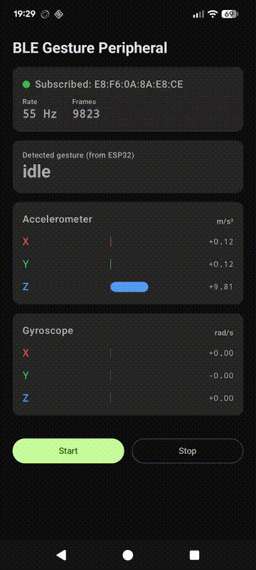
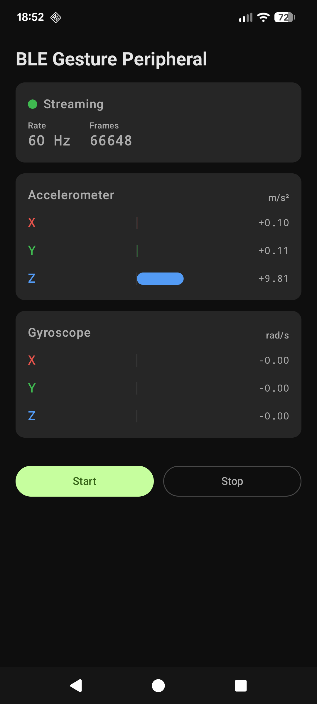

# BLE Gesture Recognition — Wireless TinyML Pipeline

End-to-end **TinyML** demo: a phone streams its IMU over **Bluetooth Low Energy**
to an **ESP32-S3**, which runs a quantized **1D-CNN** with **TensorFlow Lite Micro**
to recognize hand gestures **on-device** — no cloud, no phone-side ML.

It is the wireless sibling of a wired I²C gesture project: **the same model architecture
and on-device runtime, only the data-ingestion path changes** (I²C → BLE). That is the
whole point — it shows the inference layer is **sensor-source-agnostic**.

> **Status: working end-to-end.** Phone → BLE → ESP32 → live on-device inference.
> `idle` / `shake` / `rotate` are robust; taps are recognized with on-device
> energy + confidence gating (see [Limitations](#limitations--next-steps)).
> The prediction is written **back** over BLE and shown on the phone — the whole
> demo runs on a phone + the board alone, no laptop needed.

---

## Demo

<p align="center">
  
  &nbsp;&nbsp;&nbsp;
  
</p>

<p align="center">
  <em>Closed loop on one screen: the phone streams 6-axis IMU over BLE, the ESP32 runs
  inference and writes the result back — the “Detected gesture (from ESP32)” card updates live.</em>
</p>

## Architecture

```
┌─────────────────────┐                  ┌──────────────────────────┐
│  Phone (Android)    │                  │        ESP32-S3          │
│                     │                  │   (Zephyr RTOS)          │
│  Accelerometer +    │                  │                          │
│  Gyroscope  ~60 Hz  │                  │  BLE central             │
│        │            │                  │     │ GATT notify        │
│        ▼            │ ── BLE GATT ──►  │     ▼                    │
│  custom GATT server │   notifications  │  ring buffer (100×6)     │
│  (Kotlin/Compose)   │   12 B/frame     │     │ window full?       │
│  0000ec00-…         │   6 × int16      │     ▼                    │
│                     │                  │  z-normalize             │
│                     │                  │     ▼                    │
│                     │                  │  int8 quantize           │
│                     │                  │     ▼                    │
│                     │                  │  TFLite Micro Invoke()   │
│                     │                  │     ▼                    │
│                     │                  │  energy + conf gating    │
│                     │                  │     ▼                    │
│                     │                  │  gesture → serial / LED  │
│  "Detected: shake"  │ ◄── BLE write ── │  + write index back      │
└─────────────────────┘                  └──────────────────────────┘
```

**Closed loop:** the predicted gesture index (1 byte) is written *back* over the same BLE
connection to the phone, which displays it live in a "Detected gesture" card — so the entire
demo runs on a phone plus the board, with no laptop in the loop.

## Results

| | |
|---|---|
| Model | 1D-CNN, **~3,000 params** (Conv1D ×3 → GlobalAvgPool → Dense) |
| Input | `[100, 6]` — 100 samples (~1.7 s @ ~59 Hz) × 6 channels (ax,ay,az,gx,gy,gz) |
| Classes | `idle`, `single_tap`, `double_tap`, `shake`, `rotate` |
| Float32 accuracy | **98%** (held-out validation) |
| **int8 accuracy** | **94%** (post-training quantization) |
| Deployed model size | **12.5 KB** (`.tflite`, fully int8) |
| On-device RAM | ~24 KB tensor arena; firmware fits in <50% of ESP32-S3 SRAM |
| Inference | TensorFlow Lite Micro on the Xtensa core |

## The full TinyML pipeline

Everything here was built and run end-to-end:

```
1. Collect   tools/ble_imu_recorder.py   laptop = BLE central, records labelled
                                          2 s windows per gesture → CSV
2. Preprocess training/preprocess.py      center-crop to 100 samples, per-window
                                          per-channel z-normalization → dataset.npz
3. Train     training/train.py            1D-CNN, stratified split, early stopping
                                          → fp32 model (98% val)
4. Quantize  training/quantize.py         int8 PTQ with representative dataset
                                          → gesture_int8.tflite (94% val)
5. Export    tools/tflite_to_c.py         .tflite → C array embedded in firmware
6. Deploy    esp32_ble_inference/         Zephyr app: BLE central + ring buffer
                                          + znorm + quantize + TFLM Invoke
```

### On-device robustness (beyond the textbook pipeline)

Per-window z-normalization makes the model **amplitude-blind** (a gentle wiggle and a
vigorous shake normalize to the same thing). To stop tiny movements from firing as
`shake`/`rotate`, the firmware adds two cheap gates using information z-norm throws away:

- **Energy gate** — the raw per-channel std (motion amplitude, measured *before* z-norm)
  must clear a floor; `shake`/`rotate` additionally require *high* energy. This exploits
  each gesture's characteristic energy signature (idle ≈ 15, tap ≈ 50–900, shake/rotate ≈ thousands).
- **Confidence gate** — the dequantized softmax probability of the top class must clear a
  threshold, suppressing ambiguous transition windows.

## Repository layout

| Path | What |
|---|---|
| `phone_collector/android_app/` | Android BLE-peripheral app (Kotlin + Jetpack Compose) — reads IMU, advertises the custom GATT service, streams 12-byte frames |
| `esp32_ble_inference/` | ESP32-S3 Zephyr firmware — BLE central + TFLite Micro inference |
| `training/` | `preprocess.py`, `train.py`, `quantize.py` + the deployed `gesture_int8.tflite` |
| `tools/` | `ble_imu_recorder.py` (dataset capture), `tflite_to_c.py`, UDP/HTTP listeners, CSV analyzer |
| `docs/PLAN.md` | Milestone breakdown |

## Hardware

| Component | What |
|---|---|
| IMU source | Any Android phone (built-in accel + gyro) |
| Inference | ESP32-S3-DevKitC (16 MB flash, 8 MB PSRAM, 512 KB SRAM) running Zephyr |

## Reproduce

**Train (laptop):**
```bash
python -m venv .venv && ./.venv/bin/pip install -r tools/requirements.txt
# 1. record gestures from the phone over BLE
./.venv/bin/python tools/ble_imu_recorder.py --out training/dataset --n 50
# 2-4. preprocess → train → quantize
./.venv/bin/python training/preprocess.py
./.venv/bin/python training/train.py
./.venv/bin/python training/quantize.py
# 5. embed the model into the firmware
./.venv/bin/python tools/tflite_to_c.py training/models/gesture_int8.tflite \
    esp32_ble_inference/src/model_data.cc
```

**Build & flash (ESP32-S3, Zephyr):**
```bash
cd ~/zephyrproject && source .venv/bin/activate && source zephyr/zephyr-env.sh
west build -p always -b esp32s3_devkitc/esp32s3/procpu /path/to/esp32_ble_inference
west flash
tio /dev/ttyACM0 -b 115200
```

**Phone:** open `phone_collector/android_app/` in Android Studio, run on a device, press **Start**.

## Tech stack

`Zephyr RTOS` · `TensorFlow Lite Micro` · `TensorFlow / Keras` (training) ·
`Bluetooth Low Energy (GATT)` · `Kotlin` + `Jetpack Compose` · `Python` · `ESP32-S3 (Xtensa)`

## Limitations & next steps

- **Taps are imperfect.** A tap is a brief impulse (~0.2 s); the on-device window isn't
  aligned to it, so taps are recognized intermittently and with lower confidence.
  Planned fixes: **sliding/overlapping windows** (infer every ~25 new samples) and
  **retraining with fixed-scale normalization** so the model can use amplitude directly.
- The model was trained on phone-in-hand motion; accuracy depends on reproducing similar gestures.

## License

MIT
